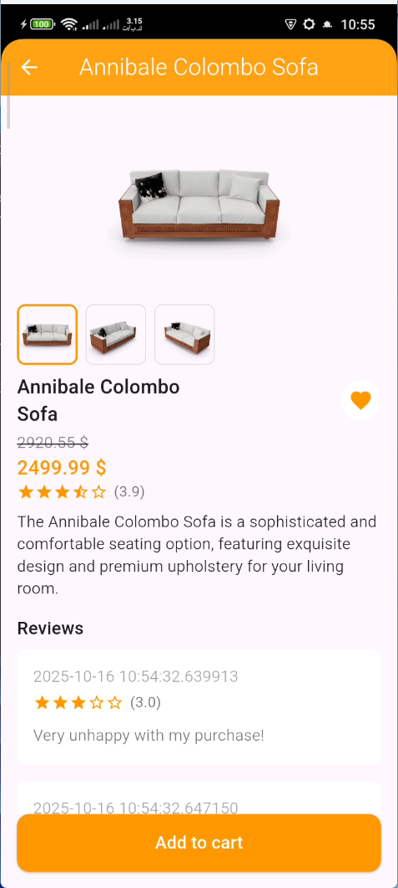
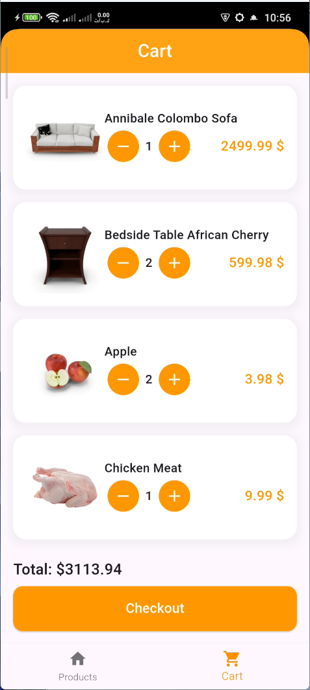

# 🛍️ Shopix – Simple E-Commerce App

## 📱 Overview  
**Shopix** is a simple and modern **Flutter e-commerce app** that allows users to browse products, view details, add them to the cart, update quantities, and see the total price in real time.

---

## ✨ Features  
- 🏪 Browse a list of products in a clean grid layout  
- 🔍 View detailed information about each product  
- ➕ Add products to the cart from multiple pages  
- 🔄 Increase or decrease product quantity inside the cart  
- 🗑️ Remove products easily  
- 💰 Auto-calculated total price  
- ⚙️ Built with **Cubit (Bloc)** for state management  
- 🧩 Uses **GetIt** for dependency injection  
- 💫 Animated splash screen with logo animation  

---

## 🧱 Technologies Used  

| Technology | Purpose |
|-------------|----------|
| **Flutter** | UI development |
| **Bloc / Cubit** | State management |
| **GetIt** | Dependency Injection |
| **Dio** *(optional)* | API handling |
| **Gap Package** | Spacing between widgets |

---

## 📸 Screenshots  

| Home | Product Details | Cart |
|------|------------------|------|
|  |  |  |

